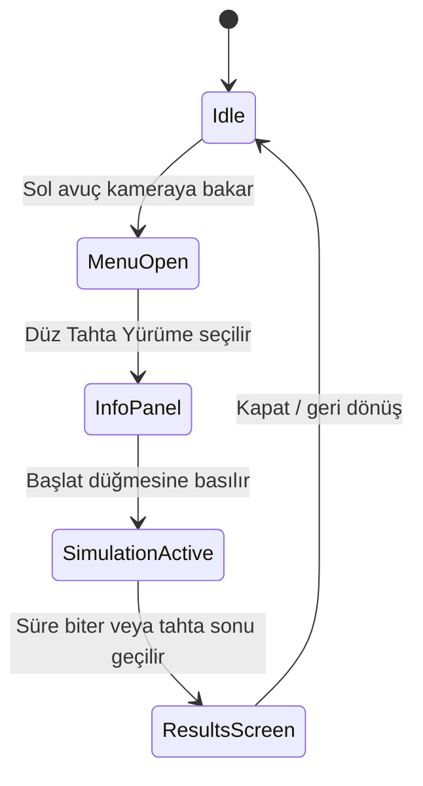

# AlcoholSimVR

## Meta Quest Passthrough Tabanlı Alkol Etkisi ve Denge Simülasyonu

**AlcoholSimVR**, Meta Quest 3/3S üzerinde çalışan bir karma gerçeklik ders projesidir. Proje, alkolün denge, görsel algı ve karar verme üzerindeki olumsuz etkilerini kullanıcının kendi fiziksel ortamında deneyimletmeyi amaçlar. Kullanıcı, passthrough görüntü açıkken sanal bir düz tahta üzerinde yürür; sistem seçilen etki seviyesine göre görsel bozulma, baş hareketi gecikmesi ve tahta hareketi uygular. Oturum sonunda kullanıcının tahta üzerinde kalma performansı ölçülür.

Bu README, projeyi ders teslimi ve sunum formatında açıklamak için hazırlanmıştır.

---

## 1. Proje Künyesi

| Alan | Açıklama |
|---|---|
| Proje adı | AlcoholSimVR |
| Proje türü | Karma gerçeklik eğitim ve farkındalık simülasyonu |
| Hedef cihaz | Meta Quest 3 / Meta Quest 3S |
| Motor | Unity 6 |
| XR altyapısı | Meta XR / OVR / OpenXR |
| Görüntüleme | Passthrough Mixed Reality |
| Etkileşim | El takibi, palm-facing menü, pinch seçim |
| Ana senaryo | Düz tahta yürüme denge testi |
| Ölçüm çıktısı | Toplam süre, tahta üzerinde kalma süresi, denge skoru |
| THS seviyesi | THS 7 - Gerçek ortamda sistem prototipi |

---

## 2. Problem Tanımı

Alkol kullanımının denge, koordinasyon ve görsel algı üzerindeki etkileri çoğu zaman teorik olarak anlatılır. Ancak kullanıcı, bu etkileri kendi bedeni ve kendi çevresi içinde deneyimlemediği için risk algısı zayıf kalabilir.

Bu proje şu probleme odaklanır:

- Alkolün denge kaybı ve algı bozulması üzerindeki etkisini güvenli biçimde deneyimletmek.
- Gerçek ortamdan kopmadan, kullanıcının fiziksel çevresini görmesini sağlamak.
- Deneyimi ölçülebilir bir görevle desteklemek.
- Eğitim ve farkındalık amacıyla kullanılabilecek etkileşimli bir prototip sunmak.

---

## 3. Çözüm Yaklaşımı

AlcoholSimVR, kullanıcının gerçek dünyasını arka plan olarak koruyan passthrough MR yaklaşımını kullanır. Kullanıcı fiziksel ortamını görmeye devam ederken, sahneye sanal bir tahta yerleştirilir. Kullanıcı bu tahta üzerinde yürümeye çalışır.

Simülasyon sırasında:

- Baş hareketine bağlı gecikmeli görsel tepki uygulanır.
- Düşük, orta ve yüksek olmak üzere üç alkol etki seviyesi seçilebilir.
- Passthrough görüntüsü siyaha düşmeden korunur.
- Sanal tahta seçilen seviyeye göre yanal kayma yapabilir.
- Kullanıcının kafa izdüşümünün tahta üzerinde kalıp kalmadığı ölçülür.
- Oturum sonunda performans sonucu gösterilir.

---

## 4. Ana Özellikler

### Passthrough MR Deneyimi

Uygulama, Meta Quest passthrough görüntüsünü ana ortam olarak kullanır. Bu sayede kullanıcı tamamen sanal bir ortama alınmaz; gerçek çevresini görmeye devam eder.

İlgili bileşenler:

- `MRRuntimeConfigurator`
- `PassthroughBootstrap`
- `OVRPassthroughLayer`

### Kontrolcüsüz El Takibi

Kullanıcı arayüzü kontrolcü gerektirmez. Sol avuç içi kameraya çevrildiğinde bilek menüsü açılır. Sağ elle pinch hareketi yapılarak menü seçimleri gerçekleştirilebilir.

İlgili bileşenler:

- `HandTrackingSetup`
- `HandPalmDetector`
- `WristMenuPanel`
- `MRUIButton`

### Düz Tahta Yürüme Testi

Sanal tahta gerçek oyun alanına göre yerleştirilir. Sistem önce Meta boundary/play area verisini kullanır, mümkün değilse raycast ve fallback yerleşim mantığına geçer.

İlgili bileşenler:

- `BoardManager`
- `BeamWalkTrigger`
- `SessionTracker`

### Üç Kademeli Alkol Etkisi

Kullanıcı simülasyon başlamadan önce etki seviyesini seçer:

- **Düşük:** Hafif algı gecikmesi ve düşük tahta hareketi.
- **Orta:** Belirgin baş hareketi gecikmesi ve denge zorlanması.
- **Yüksek:** Sert frame-hold hissi, yüksek görsel bozulma ve daha güçlü tahta kayması.

İlgili bileşen:

- `AlcoholEffectController`

### Performans Ölçümü

Oturum sırasında kullanıcının kafa izdüşümü tahta üzerinde mi değil mi ölçülür. Simülasyon sonunda denge yüzdesi hesaplanır.

Ölçülen değerler:

- Toplam değerlendirme süresi
- Tahta üzerinde kalma süresi
- Denge skoru yüzdesi

İlgili bileşenler:

- `SessionTracker`
- `ResultsPanelController`

---

## 5. Sistem Akışı



Akışı yöneten ana sınıf:

- `Assets/Scripts/Core/AppManager.cs`

---

## 6. Teknik Mimari

```text
Assets/Scripts
├── Core
│   ├── AppManager.cs
│   ├── HandTrackingSetup.cs
│   ├── MRRuntimeConfigurator.cs
│   ├── PassthroughBootstrap.cs
│   └── SessionTracker.cs
├── Simulation
│   ├── AlcoholEffectController.cs
│   ├── BeamWalkTrigger.cs
│   └── BoardManager.cs
├── UI
│   ├── CanvasFadeAnimator.cs
│   ├── InfoPanelController.cs
│   ├── MRUIButton.cs
│   ├── ResultsPanelController.cs
│   ├── SimulationHudController.cs
│   └── WristMenuPanel.cs
└── Utilities
    ├── HandPalmDetector.cs
    ├── MRInputHelper.cs
    ├── OVRHandUtility.cs
    └── WorldSpaceBillboard.cs
```

### Mimari kararlar

- MR ayarları runtime'da zorlanır.
- `OVRCameraRig` root transformu doğrudan hareket ettirilmez.
- Passthrough ortamı korunurken görsel etki child offset ve passthrough style parametreleriyle uygulanır.
- Uygulama durumu tek merkezden `AppManager` ile yönetilir.
- Test sonucu ayrı bir `SessionTracker` bileşeninde hesaplanır.

---

## 7. THS Değerlendirmesi

Bu proje **THS 7** seviyesinde değerlendirilmiştir.

| Kriter | Puan |
|---|---:|
| Çalışan modül oranı | 4/5 |
| Gerçek ortam testi | 5/5 |
| Hata toleransı | 4/5 |
| Kullanıcı doğrulaması | 4/5 |
| Performans metriği | 5/5 |

Toplam:

```text
22 / 25 = 88 / 100
```

Bu puan, verilen modele göre **THS 7 - Gerçek ortamda sistem prototipi** seviyesine karşılık gelir.

THS 7 gerekçesi:

- Uygulama gerçek passthrough ortamında çalışmak üzere tasarlanmıştır.
- Kullanıcı fiziksel alanında yürüyüş görevini gerçekleştirir.
- Sistem yalnızca demo değil, baştan sona çalışan bir prototip akışı sunar.
- Ölçülebilir performans metriği üretir.
- El takibi, MR arayüzü, simülasyon ve sonuç ekranı entegre çalışır.

---

## 8. RAMS Özeti

### Reliability

Uygulama, merkezi durum makinesi ve runtime MR yapılandırması sayesinde temel güvenilirlik sağlar. Passthrough, kamera ve el takibi ayarları başlangıçta zorlanır.

### Availability

APK çıktısı ve Android/Quest hedefi sayesinde cihaz üzerinde çalıştırılabilir. Ana uygulama akışı internet bağlantısına bağlı değildir.

### Maintainability

Kod yapısı `Core`, `Simulation`, `UI` ve `Utilities` olarak ayrılmıştır. Bu yapı yeni özellik eklemeyi ve hata ayıklamayı kolaylaştırır.

### Safety

Passthrough ortamı korunur. Kullanıcı tamamen siyah veya kapalı bir sanal ortama alınmaz. Fiziksel test alanının boş ve güvenli olması gerekir.

---

## 9. Kurulum

### Gereksinimler

- Unity 6
- Meta Quest 3 veya Meta Quest 3S
- Meta XR Core SDK / OVR bileşenleri
- Android build desteği
- Developer Mode açık Meta Quest cihazı

### Unity içinde proje ayarları

Unity menüsünden:

```text
AlcoholSimVR > 1 - Proje Ayarlarını Uygula (Passthrough + Eller)
```

Bu işlem:

- Hand tracking desteğini ayarlar.
- Passthrough desteğini gerekli hale getirir.
- Build settings içine ana sahneyi ekler.

### Sahne onarımı

Ana sahneyi açtıktan sonra:

```text
AlcoholSimVR > 2 - Mevcut Sahneyi Onar (Passthrough + Eller)
```

Bu işlem:

- Passthrough layer'ı doğrular.
- Kamera clear flag ve alpha ayarlarını düzeltir.
- OVRManager yapılandırmasını kontrol eder.
- El takibi ve bilek menüsü referanslarını bağlar.

### Build

Önerilen build ayarları:

| Ayar | Değer |
|---|---|
| Platform | Android |
| Scripting Backend | IL2CPP |
| Target Architecture | ARM64 |
| XR | OpenXR / Meta XR |
| Ana sahne | `Assets/Scenes/MainScene.unity` |

---

## 10. Kullanım Senaryosu

1. Kullanıcı Meta Quest cihazını takar.
2. Uygulama passthrough ortamında açılır.
3. Kullanıcı sol avucunu kameraya çevirir.
4. Bilek menüsü görünür.
5. Kullanıcı `Düz Tahta Yürüme` seçeneğini seçer.
6. Bilgi panelinden düşük, orta veya yüksek etki seviyesi seçilir.
7. `Başlat` düğmesine basılır.
8. Sanal tahta gerçek alanda görünür.
9. Kullanıcı tahta boyunca yürümeye çalışır.
10. Sistem denge performansını ölçer.
11. Oturum sonunda sonuç paneli gösterilir.

---

## 11. Güvenlik Notları

Bu proje eğitim ve farkındalık amaçlıdır. Kullanıcı güvenliği için:

- Test alanı boş ve düz olmalıdır.
- Kullanıcı gerçek dünyayı passthrough ile görmeye devam etmelidir.
- Gerçek tahta kullanılacaksa yükseltilmiş platform olmamalıdır.
- Yüksek etki seviyesi kullanılırken gözetmen bulunması önerilir.
- Simülasyon, gerçek alkol tüketimini teşvik etmez; alkolün olumsuz etkilerini göstermeyi amaçlar.

---

## 12. Teslim Dokümanları

Proje için hazırlanan PDF raporları `docs` klasöründedir:

| Dosya | Puan | İçerik |
|---|---:|---|
| [`docs/SWOT.pdf`](docs/SWOT.pdf) | 10 | Güçlü yönler, zayıf yönler, fırsatlar ve tehditler |
| [`docs/RAMS.pdf`](docs/RAMS.pdf) | 5 | Reliability, Availability, Maintainability, Safety analizi |
| [`docs/THS_report.pdf`](docs/THS_report.pdf) | 5 | THS 7 puanlaması ve gerekçesi |
| [`docs/Requirements.pdf`](docs/Requirements.pdf) | 5 | Fonksiyonel ve fonksiyonel olmayan gereksinimler |
| [`docs/UserScenario.pdf`](docs/UserScenario.pdf) | 5 | Kullanıcı senaryosu ve alternatif akışlar |

Toplam doküman puanı: **30 puan**

---

## 13. Proje Çıktıları

Bu projede teslim edilen ana çıktılar:

- Unity MR uygulama projesi
- Meta Quest Android APK çıktısı
- Passthrough tabanlı düz tahta yürüme simülasyonu
- El takibiyle çalışan MR kullanıcı arayüzü
- Üç kademeli alkol etkisi sistemi
- Denge performansı ölçüm sistemi
- THS 7 raporu ve teknik doküman seti

---

## 14. Geliştirme Fırsatları

Proje THS 7 seviyesinde gerçek ortam prototipi olarak değerlendirilebilir. Daha üst seviye için önerilen geliştirmeler:

- Oturum sonuçlarını CSV/JSON olarak kaydetme
- Daha geniş kullanıcı testi
- Cihaz üstü FPS ve gecikme ölçümü
- Eğitimci paneli
- Farklı görev modları: reaksiyon testi, çizgi takibi, el-göz koordinasyonu
- Kullanıcı öncesi/sonrası karşılaştırmalı rapor

---

## 15. Kısa Sunum Metni

AlcoholSimVR, Meta Quest passthrough teknolojisini kullanarak alkolün denge ve algı üzerindeki etkilerini güvenli bir karma gerçeklik ortamında deneyimleten bir ders projesidir. Kullanıcı gerçek çevresini görmeye devam ederken sanal bir düz tahta üzerinde yürür. Sistem seçilen alkol etkisi seviyesine göre görsel gecikme, denge zorlanması ve tahta kayması uygular. Oturum sonunda kullanıcının tahta üzerinde kalma oranı ölçülerek denge skoru üretilir.

Bu yönleriyle proje, yalnızca teorik bir simülasyon değil; gerçek ortamda çalışan, kullanıcıyla etkileşen ve ölçüm alabilen **THS 7 seviyesinde bir sistem prototipidir**.

