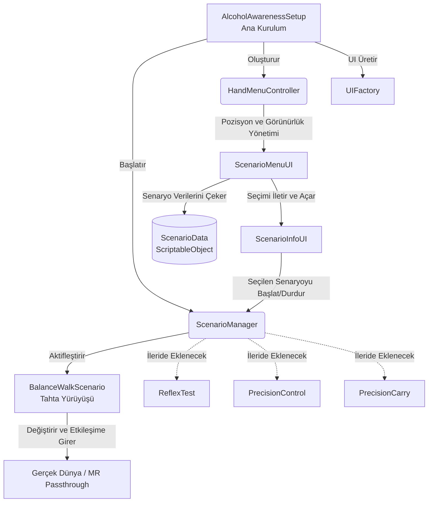

# AddictionSimVr 🥽

AddictionSimVr, Meta Quest cihazları için geliştirilmiş bir **Karma Gerçeklik (Mixed Reality - MR)** simülasyon projesidir. Temel amacı, alkol gibi maddelerin motor beceriler, denge ve algı üzerindeki olumsuz etkilerini kullanıcıya güvenli bir karma ortamda deneyimletmektir.

## 🚀 Mevcut Durum

Proje şu anda geliştirme aşamasındadır. Bugüne kadar uygulanan temel özellikler şunlardır:

- [x] **Karma Gerçeklik (MR) Altyapısı:** Passthrough (geçirgenlik) modu ve XR Interaction Toolkit entegrasyonu tamamlandı.
- [x] **Dinamik El Menüsü (Hand Menu):** Kullanıcının sol avuç içine sabitlenen ve avuç içi yüze dönük olduğunda aktifleşen MR arayüzü (UI) geliştirildi.
- [x] **Arayüz Panelleri:** Senaryo seçimi (ScenarioMenuUI) ve detaylı bilgi/başlatma (ScenarioInfoUI) panelleri sisteme entegre edildi.
- [x] **Simülasyonlar (1/4 Tamamlandı):**
  - 🟢 **Denge Yürüyüşü (Balance Walk):** Kullanıcının gerçek odasında yere sanal bir çizgi/tahta yerleştirerek, denge bozucu görsel ve işitsel efektler altında yürümesi simülasyonu. *(Tamamlandı)*
  - 🔴 **Refleks Testi (Reflex Test):** *(Planlanıyor)*
  - 🔴 **Hassas Kontrol (Precision Control):** *(Planlanıyor)*
  - 🔴 **Hassas Taşıma (Precision Carry):** *(Planlanıyor)*

## 🏗️ Mimari ve İşleyiş

Proje, genişletilebilirliği sağlamak adına modüler bir yapıda tasarlanmıştır. Temel mimari aşağıdaki diyagramda görselleştirilmiştir:

### Temel Bileşenler
- **`AlcoholAwarenessSetup`:** Projenin başlangıç (entry) noktasıdır. Gerekli tüm UI elemanlarını ve yöneticileri çalışma zamanında (runtime) hiyerarşik olarak oluşturur.
- **`HandMenuController`:** Meta Quest el/kontrolcü takibini kullanarak, menüyü kullanıcının avuç içi hizasına dinamik olarak yerleştirir.
- **`UIFactory`:** Dünya uzayında (World Space) Canvas'lar, butonlar ve metinler üretmekten sorumlu merkezi tasarım fabrikasıdır.
- **`ScenarioManager`:** Hangi senaryonun aktif olduğunu takip eder, senaryolar arası geçişleri sağlar ve ilgili senaryo sınıflarını (örn. `BalanceWalkScenario`) çalıştırır.
- **`BalanceWalkScenario`:** Özel olarak "Denge Yürüyüşü" simülasyonunun mekaniklerini (çizgi yerleştirme, denge bozucu efektler vb.) barındırır.

## 🛠️ Kullanılan Teknolojiler
- **Oyun Motoru:** Unity 3D
- **Platform:** Meta Quest 3 / 3S
- **Frameworkler:** XR Interaction Toolkit (XRI), AR Foundation, Meta XR SDK

---
*Not: Bu proje bağımlılık simülasyonu ve farkındalık yaratma amaçlı geliştirilmektedir.*
