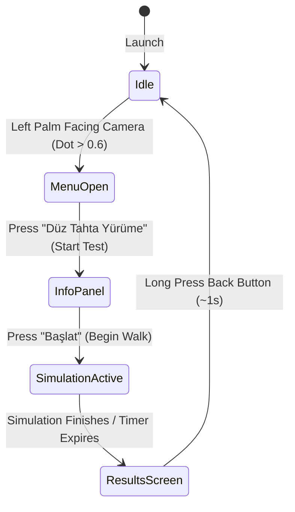

# 🧠 AlcoholSimVR — Meta Quest 3S MR Alcohol Impairment Simulator

[-blue.svg?style=flat&logo=unity)](https://unity.com/)
[](https://www.meta.com/quest/)
[](https://developer.oculus.com/experimental/passthrough/)
[](https://developer.oculus.com/documentation/unity/unity-handtracking/)

An immersive **Mixed Reality (MR) Passthrough** simulator designed for the **Meta Quest 3 / 3S** to replicate the physical, visual, and cognitive effects of alcohol impairment. Using controller-free **Hand Tracking**, a realistic procedural **Camera Sway**, and dynamic **URP Post-Processing visual distortions**, users can experience and test their motor skills through a simulated field sobriety test (Plank Walking) in their physical environment.

---

## 🇹🇷 Türkçe Özet / Turkish Summary

**AlcoholSimVR**, Meta Quest 3/3S Passthrough (Karma Gerçeklik) modunda çalışan, alkolün fiziksel ve görsel motor beceriler üzerindeki olumsuz etkilerini simüle eden interaktif bir MR uygulamasıdır. 
- **El Takibi (Kontrolörsüz):** Arayüz etkileşimleri ve bilek menüsü tamamen el hareketleriyle (pinch & palm-facing) kontrol edilir.
- **Fiziksel Bozulma:** Kamera sallantısı (`CameraSwayOffset`) ve URP post-processing hacmi ile çift görme, bulanıklık ve denge kaybı hissi gerçekçi bir şekilde taklit edilir.
- **Düz Tahta Yürüme Testi:** Kullanıcının fiziksel ortamına yerleştirilen sanal/fiziksel bir tahta üzerinde dengede yürüme performansı ölçülür ve oturum sonunda raporlanır.

---

## 🚀 Key Features / Temel Özellikler

*   **High-Fidelity MR Passthrough:** Integrates real-world environments with high-resolution color passthrough as the background canvas.
*   **100% Controllerless Hand Tracking:** Optimized for standard hands-only interaction. Pinches operate UI buttons, and looking at the left palm displays the wrist-mounted menu.
*   **Procedural Alcohol Distortion (Camera Sway & URP PP):**
    *   *Visuals:* Blurred vision, double-vision (chromatic aberration/offset), and heavy vignette effects controlled by the blood alcohol simulation.
    *   *Motor Impairment:* Procedural rotational camera sway on a dedicated `CameraSwayOffset` sub-object ensures the OVRCameraRig's physics bounds remain intact while disorienting the player.
*   **Straight Plank Walking Sobriety Test:** Procedurally aligns a virtual balance board with physical walking boards. Detects slips, duration, and alignment errors.
*   **State-driven Session Tracking:** Log performance metrics including task duration, balance slips, peak alcohol percentage, and recovery status.

---

## 🗺️ System Architecture & State Machine

The core state flow of the simulator is driven by a central `AppManager.cs` state machine:



---

## 📁 Project Structure & Scripts Directory

All custom logic is located within the `Assets/Scripts/` directory:

```bash
Assets/Scripts/
├── Core/
│   ├── AppManager.cs               # Central application state controller
│   ├── HandTrackingSetup.cs        # Activates/modifies Meta Quest hand tracking settings
│   ├── MRRuntimeConfigurator.cs    # Runtime Passthrough layer and URP camera overrides
│   ├── PassthroughBootstrap.cs     # Quick Passthrough initializer on scene load
│   └── SessionTracker.cs           # Collects and formats simulation metrics
├── Simulation/
│   ├── AlcoholEffectController.cs  # Procedural camera sway & post-processing controller
│   ├── BeamWalkTrigger.cs          # Logic checking player foot position on the plank
│   └── BoardManager.cs             # Generates, spawns, and scales the virtual balance board
├── UI/
│   ├── CanvasFadeAnimator.cs       # Clean canvas fade-in/out transitions
│   ├── InfoPanelController.cs      # Displays test rules and pre-start configurations
│   ├── MRUIButton.cs               # Premium 3D interactive MR buttons (hover/pinch)
│   ├── ResultsPanelController.cs   # Displays final sobriety statistics
│   ├── SimulationHudController.cs  # Shows active stats (BAC %, time) during walk
│   └── WristMenuPanel.cs           # Tracks user wrist, active when palm is turned to face
└── Utilities/
    ├── HandPalmDetector.cs         # Mathematical checks for palm-facing-camera detection
    ├── MRInputHelper.cs            # Custom raycasting and hand-tracking action helpers
    ├── OVRHandUtility.cs           # OVR hand reference helpers
    └── WorldSpaceBillboard.cs      # Keeps 3D UI canvases oriented towards the headset
```

---

## 🛠️ Prerequisites & Installation / Kurulum ve Gereksinimler

### Requirements
*   **Unity Editor:** Version `6 (6000.0.x)` (using Universal Render Pipeline - URP).
*   **Platform:** Android (Meta Quest 3, 3S, or Quest Pro).
*   **Meta SDKs:** Meta XR Core SDK / Oculus Integration Package.

---

### 🔧 Setup Instructions / Kurulum Adımları

#### 1. Open Project & Import
Open the project folder inside **Unity Hub** using **Unity 6**.

#### 2. Apply Automated Settings (Proje Ayarlarını Uygula)
To configure the Android Manifest and XR settings automatically for MR Passthrough and Hands-Only tracking, navigate to:
> **AlcoholSimVR** ➔ **1 - Proje Ayarlarını Uygula (Passthrough + Eller)**

*This is a mandatory step that sets the hand-tracking manifest options correctly.*

#### 3. Fix / Prepare Current Scene (Mevcut Sahneyi Onar)
Open `Assets/Scenes/MainScene.unity` and run:
> **AlcoholSimVR** ➔ **2 - Mevcut Sahneyi Onar (Passthrough + Eller)**

*This automatically adjusts the main camera's background clear flags, sets URP post-processing, and configures the OVRManager for Insight Passthrough.*

#### 4. Build and Deploy (Derleme ve Cihaza Yükleme)
1. Go to **File ➔ Build Settings**.
2. Switch platform to **Android**.
3. Configure the following parameters:
   * **Scripting Backend:** `IL2CPP`
   * **Target Architectures:** `ARM64`
   * **Graphics APIs:** `Vulkan`
4. Add `MainScene` to the build.
5. Click **Build and Run** with your Meta Quest connected in Developer Mode.

---

## 🎮 How to Play / Nasıl Oynanır

1. **Start the App:** Once launched, keep controllers away. Put on your Meta Quest headset.
2. **Wrist Menu:** Raise your left hand and turn your left palm toward your face. A sleek futuristic wrist panel will fade in.
3. **Select Test:** Tap the **"Düz Tahta Yürüme"** (Straight Plank Walking) option using your right hand by pinching your thumb and index finger together.
4. **Prepare Board:** Put a real wooden plank (or draw a line) on your room floor. Line up the virtual blue plank with the physical marker.
5. **Walking Simulation:** Press **"Başlat"** (Start). Walk along the line. As you move forward, the alcohol effects will slowly ramp up (BAC % increases).
6. **Impairment:** Your vision will blur, double-vision will intensify, and the camera will swing side-to-side, causing you to lose balance. Avoid stepping off the board!
7. **Results:** After finishing or falling off, check your final sobriety stats on the floating results board. Hold down the back button to reset back to idle.

---

## ⚙️ Customization via Inspector

The application is highly customizable. Developers can modify the following parameters in the Inspector:

*   **Alcohol Thresholds & Ramp Speed:** The rate at which simulated blood alcohol levels (BAC %) rise and the maximum allowed level.
*   **Camera Sway Parameters:** Customize sway speed, horizontal/vertical amplitude, and random noise to change the "drunkenness" feeling.
*   **Post-Process Weights:** Adjust maximum chromatic aberration, blur size, and vignette strength.
*   **Palm Detector Threshold:** Set the dot product value (default `> 0.6`) required for wrist menu activation.

---

## 📜 License

This project is open-source and available under the **MIT License**.
Designed and developed for Meta Quest Mixed Reality exploration.
